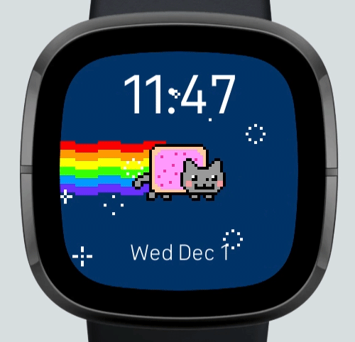

### Nyan Cat Clock Overview

This Fitbit clock features the classic Nyan Cat animation on a simple clockface design.

This clock is design for Fitbit Sense and Versa 3 so other versions are not compatible. 

### Features 
- Clock and date display
- Nyan Cat forever!
- Dark Mode Setting: option to change to a black background for dark mode inclined users
### Features In Work

- Goal Counters (Heart Rate, Steps, Calories, Distance) on display on active face with Settings to turn on or off
- Goal Counters cycle through all options by tapping on the counter on the main face
- Always On: Fades into a white outline of Nyan Cat and the stars along with the Time and Date on a black background
- Advanced Color Customization: Text color options in Settings

### Credit

I have no ownership of Nyan Cat and am not associated to Nyan Cat in any shape or fashion. I also do not make any money from this. I am simply a lover of Nyan Cat!

Nyan Cat is copyrighted by the gif's original creator, Chris Torres. Thank you Chris for bringing Nyan Cat into our lives! 

### Bugs? Contact Me!

I am humbly a new coder and this is my Fitbit clock design - please let me know if there is something wrong and I will do my best to fix it. 

Thank you for taking interest in my Fitbit clock face and I hope you enjoy it! :)
